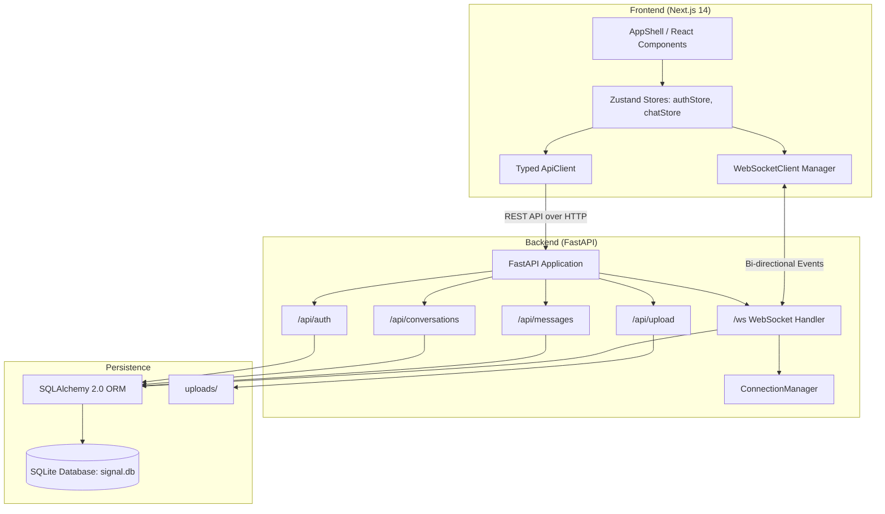
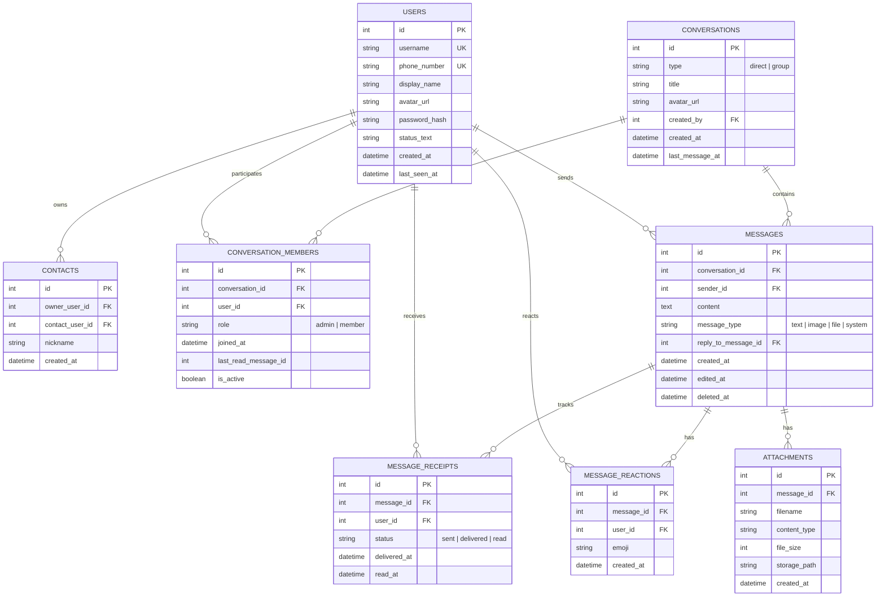

# Signal Messenger Clone — Production-Quality Full-Stack Platform

An independent, educational clone of the Signal Desktop messaging application built for the **Scaler SDE Fullstack Assignment**. This project recreates Signal's desktop three-part interface, real-time message exchange, delivery states, group conversations, contacts, reactions, and simulated encryption workflows.

---

## 1. Project Overview

This platform reproduces the Signal Messenger user experience using a modern, decoupled full-stack architecture:
- **Frontend**: Next.js App Router with TypeScript, Tailwind CSS, Lucide icons, and Zustand.
- **Backend**: Python 3.12 with FastAPI, SQLite persistence, and SQLAlchemy 2.0.
- **Real-Time Communication**: Bi-directional WebSockets with connection lifecycle management, heartbeat ping/pong, and room-level event broadcasting.

> **Disclaimer**: This is an independent educational clone built for evaluation purposes. It does not use official Signal trademarks and does not implement the proprietary Signal Protocol (Double Ratchet / libsignal). Cryptographic workflows are simulated over secure WebSockets.

---

## 2. Features Implemented

### Core Messaging & Real-Time Protocols
- **Real-Time 1-on-1 Messaging**: Instant messaging over WebSockets with zero manual refresh required.
- **Delivery & Read Receipts**: Authentic checkmark progression:
  - 🕒 Sending (optimistic clock)
  - ✓ Sent (single checkmark)
  - ✓✓ Delivered (double checkmarks)
  - ✓✓ Read (double checkmarks in Signal Blue)
- **Typing Indicators**: Real-time debounce dispatch (`typing.start` and `typing.stop`) displayed as an animated 3-dot bubble in chat.
- **Online Presence & Last Seen**: Real-time tracking of connected WebSocket sessions and user last-seen timestamps.
- **Message Reactions**: Hover action bar to react with emojis (`❤️`, `👍`, `🔥`, `😂`, `😮`, `😢`), with aggregated count pills.
- **Quoted Replies**: Signal-style reply bar in the composer and quoted card inside the message bubble.
- **Attachments**: File & image upload endpoint with download and inline image preview.

### Group Messaging
- **Group Creation**: Create named groups with multiple members selected from contacts.
- **Role Administration**: Creator is automatically designated as `admin`.
- **Admin Privileges**: Admins can add members and remove members.
- **Self-Service Leaving**: Any member can leave a group.
- **Group Access Control**: Non-members cannot read messages or join group WebSocket broadcasts.
- **System Event Messages**: In-chat system notifications when members are added, leave, or the group is created.

### Visual Fidelity & Signal UX
- **Desktop 3-Pane Layout**:
  1. **Navigation Rail**: Left rail with avatar, active chats tab, calls placeholder, stories placeholder, theme switch, and settings gear.
  2. **Conversation Sidebar**: Search bar, filter pills (`All`, `Unread`, `Direct`, `Groups`), new chat pencil, new group button, and conversation items.
  3. **Main Chat Pane**: ChatHeader with presence/typing indicators, message history with date separators, and MessageComposer with auto-resizing textarea.
  4. **Contextual Right Panel**: Drawer for conversation details, group membership management, and safety numbers.
- **Light & Dark Mode**: Persistent theme selection toggled from the rail or settings.
- **Toast Notifications**: In-app feedback for message actions, errors, and member events.

### Placeholders for Secondary Modules
- **Voice / Video Calling**: "Coming Soon" dialog with WebRTC encryption explanation.
- **Stories**: "Coming Soon" dialog for 24-hour ephemeral updates.
- **Linked Devices**: "Coming Soon" dialog for QR code device synchronization.

---

## 3. Technology Stack

| Layer | Technologies |
|---|---|
| **Frontend** | Next.js 14 (App Router), TypeScript (Strict), Tailwind CSS, Zustand, Lucide React |
| **Backend** | Python 3.12, FastAPI, Uvicorn, Pydantic v2, python-jose, bcrypt |
| **Database** | SQLite, SQLAlchemy 2.0 ORM |
| **Real-Time** | WebSockets (Native FastAPI WebSocket endpoint + client manager) |
| **Testing** | Pytest, pytest-asyncio, HTTPX, Vitest, React Testing Library |
| **Containerization** | Docker, Docker Compose |

---

## 4. Architecture Overview



---

## 5. Database Schema and Relationships

Normalized SQLite schema created via SQLAlchemy 2.0:



---

## 6. Authentication and Demo OTP Details

The platform supports both password login and mock OTP verification:
- **Registration**: Allows registering with a username, display name, optional phone number, and password.
- **Login**: Authenticates via username or phone number with bcrypt password verification, returning a signed JWT access token.
- **Mock OTP Verification**: For testing without SMS gateways, a fixed OTP of **`123456`** is accepted for any registered username/phone on the `/api/auth/verify` endpoint.
- **One-Click Demo Switcher**: The Sign In screen includes direct 1-click buttons to sign in instantly as any of the 6 seeded accounts.

---

## 7. Local Installation and Setup

### Prerequisites
- Python 3.10+ (tested on Python 3.12)
- Node.js 18+ (tested on Node v22.12.0)
- npm 9+ (tested on npm 10.9.0)

### 1. Clone the Repository
```bash
git clone <repository_url>
cd SignalClone
```

### 2. Backend Setup
```bash
# Navigate to backend
cd backend

# Create virtual environment
python -m venv venv

# Activate virtual environment
# Windows:
.\venv\Scripts\activate
# macOS/Linux:
source venv/bin/activate

# Install dependencies
pip install -r requirements.txt

# Seed database with sample users and messages
python seed.py
```

### 3. Frontend Setup
```bash
# In a new terminal, navigate to frontend
cd frontend

# Install dependencies
npm install
```

---

## 8. Environment Variables

### Root / Backend (`backend/.env` or `.env`):
```env
PROJECT_NAME="Signal Messenger Clone"
VERSION="1.0.0"
SECRET_KEY="signal-super-secret-key-change-in-production-2026"
ALGORITHM="HS256"
ACCESS_TOKEN_EXPIRE_MINUTES=10080
MOCK_OTP="123456"
DATABASE_URL="sqlite:///./signal.db"
```

### Frontend (`frontend/.env.local`):
```env
NEXT_PUBLIC_API_URL=http://localhost:8000
NEXT_PUBLIC_WS_URL=ws://localhost:8000/ws
```

---

## 9. Startup Commands

### Run Backend
```bash
cd backend
.\venv\Scripts\activate
uvicorn app.main:app --host 0.0.0.0 --port 8000 --reload
```
The REST API will be available at `http://localhost:8000` and interactive OpenAPI documentation at `http://localhost:8000/docs`.

### Run Frontend
```bash
cd frontend
npm run dev
```
Open `http://localhost:3000` in your web browser.

### Run with Docker Compose
```bash
docker-compose up --build
```

---

## 10. Database Initialization & Seed Instructions

Database tables are initialized automatically on startup if they do not exist. To populate realistic sample data:

```bash
cd backend
python seed.py
```

The seeder is **strictly idempotent**: running it multiple times will never generate duplicate accounts, duplicate conversations, or duplicate messages.

---

## 11. Demo Credentials

The database comes pre-seeded with 6 interconnected demo users. All accounts use password: **`password123`**.

| Display Name | Username | Phone Number | Role / Description |
|---|---|---|---|
| **Sarah Connor** | `sarah` | `+15550101` | Security Lead (Admin of Signal Core Contributors) |
| **Alex Rivera** | `alex` | `+15550102` | Core Developer (Admin of Weekend Hikers) |
| **Elena Rostova** | `elena` | `+15550103` | UX & Accessibility Designer |
| **Marcus Vance** | `marcus` | `+15550104` | Outdoor Explorer |
| **Priya Sharma** | `priya` | `+15550105` | Distributed Systems Engineer |
| **David Chen** | `david` | `+15550106` | Cryptographic Protocols Specialist |

*Mock OTP for all accounts*: **`123456`**.

---

## 12. REST API Overview

All API endpoints are prefixed with `/api`.

| Method | Endpoint | Description | Auth Required |
|---|---|---|---|
| `POST` | `/api/auth/register` | Register new user account | No |
| `POST` | `/api/auth/login` | Login with username/phone and password | No |
| `POST` | `/api/auth/verify` | Verify with fixed mock OTP (`123456`) | No |
| `POST` | `/api/auth/logout` | Invalidate session | Yes |
| `GET` | `/api/auth/me` | Fetch currently logged in user profile | Yes |
| `GET` | `/api/users/search?q={query}` | Search users by username, name, or phone | Yes |
| `PATCH` | `/api/users/me` | Update display name, status text, or avatar | Yes |
| `GET` | `/api/contacts` | List contacts of current user | Yes |
| `POST` | `/api/contacts` | Add a user to contacts | Yes |
| `DELETE` | `/api/contacts/{id}` | Remove contact | Yes |
| `GET` | `/api/conversations` | List conversations sorted by recent activity | Yes |
| `POST` | `/api/conversations/direct` | Get or create direct 1-on-1 chat | Yes |
| `POST` | `/api/conversations/group` | Create group chat with selected members | Yes |
| `GET` | `/api/conversations/{id}` | Get conversation metadata | Yes |
| `GET` | `/api/conversations/{id}/messages` | Paginated message history | Yes |
| `POST` | `/api/conversations/{id}/messages` | Send message (broadcasts via WebSocket) | Yes |
| `POST` | `/api/conversations/{id}/read` | Mark all unread messages in chat as read | Yes |
| `POST` | `/api/conversations/{id}/members` | Add member to group (Admin only) | Yes |
| `DELETE` | `/api/conversations/{id}/members/{uid}` | Remove member or leave group | Yes |
| `POST` | `/api/messages/{id}/reactions` | Add emoji reaction | Yes |
| `DELETE` | `/api/messages/{id}/reactions` | Remove emoji reaction | Yes |
| `PATCH` | `/api/messages/{id}` | Edit message text | Yes |
| `DELETE` | `/api/messages/{id}` | Soft delete message | Yes |
| `POST` | `/api/upload` | Upload image or file attachment | Yes |
| `GET` | `/health` | Server health check endpoint | No |

---

## 13. WebSocket Event Protocol

Connecting client connects to:  
`ws://localhost:8000/ws?token=<JWT_ACCESS_TOKEN>`

### Client to Server Events
- `ping`: Keepalive ping. Server replies with `{"type": "pong"}`.
- `typing.start`: `{"type": "typing.start", "conversation_id": 1}`
- `typing.stop`: `{"type": "typing.stop", "conversation_id": 1}`
- `message.send`: `{"type": "message.send", "conversation_id": 1, "content": "Hello", "reply_to_message_id": null}`
- `message.read`: `{"type": "message.read", "conversation_id": 1}`

### Server to Client Events
- `message.created`: Broadcast when a new message is posted.
- `message.delivered`: Broadcast when an online recipient receives a message.
- `message.read`: Broadcast when a recipient reads messages.
- `typing.start` / `typing.stop`: Broadcast typing status of conversational partners.
- `presence.update`: Broadcast online/offline status updates.
- `reaction.added` / `reaction.removed`: Broadcast emoji reaction updates.
- `conversation.updated`: Broadcast group membership changes.

---

## 14. Testing Commands and Actual Results

### Automated Backend Test Suite (Pytest)
```bash
cd backend
.\venv\Scripts\pytest.exe tests/test_backend.py -v
```
**Actual Test Results**:
```
tests/test_backend.py::test_health_check PASSED                  [ 20%]
tests/test_backend.py::test_auth_registration_and_login PASSED   [ 40%]
tests/test_backend.py::test_contacts_and_conversations PASSED    [ 60%]
tests/test_backend.py::test_group_conversations_and_permissions PASSED [ 80%]
tests/test_backend.py::test_websocket_connection_and_auth PASSED [100%]
======================= 5 passed in 4.98s ========================
```

### Automated Frontend Test Suite (Vitest)
```bash
cd frontend
npx vitest run
```
**Actual Test Results**:
```
 ✓ src/__tests__/frontend.test.tsx (5 tests) 146ms
 Test Files  1 passed (1)
      Tests  5 passed (5)
```

### Frontend Production Build
```bash
cd frontend
npm run build
```
**Actual Build Result**:
```
 ✓ Compiled successfully
 ✓ Linting and checking validity of types
 ✓ Collecting page data
 ✓ Generating static pages (4/4)
 ✓ Finalizing page optimization
```

---

## 15. Deployment Instructions

### Option 1: Docker Compose (Unified Deployment)
Ensure Docker is installed and execute:
```bash
docker-compose up -d --build
```
Access the application at `http://localhost:3000`.

### Option 2: Cloud Deployment (Vercel + Render / Railway)
1. **Backend on Render / Railway**:
   - Create a Web Service connected to the GitHub repository (Root directory: `backend`).
   - Set start command: `sh -c "python seed.py && uvicorn app.main:app --host 0.0.0.0 --port $PORT"`
   - Configure persistent volume if SQLite storage persistence across restarts is desired.
   - Set environment variables (`SECRET_KEY`, `CORS_ORIGINS`).
2. **Frontend on Vercel**:
   - Import the repository (Root directory: `frontend`).
   - Set build command: `npm run build`
   - Set environment variables:
     - `NEXT_PUBLIC_API_URL=https://your-backend-domain.com`
     - `NEXT_PUBLIC_WS_URL=wss://your-backend-domain.com/ws`

---

## 16. Known Limitations

1. **In-Memory WebSocket Manager**: The real-time connection manager tracks connections in the FastAPI process memory. While suitable for single-instance deployments, scaling horizontally across multiple processes requires a Redis Pub/Sub adapter.
2. **SQLite Ephemeral Storage**: On ephemeral cloud hosts without mounted persistent disks, SQLite database files are recreated on container restart.
3. **Simulated Encryption**: End-to-end Signal Protocol keys (Double Ratchet) are simulated over encrypted TLS/WebSockets.

---

## 17. Security Disclaimer

This project is an **independent, educational demonstration clone** created for evaluation in the Scaler SDE Fullstack Assignment. It is not affiliated with, endorsed by, or connected to the Signal Technology Foundation. Plagiarism-free and original code has been written throughout the implementation.

